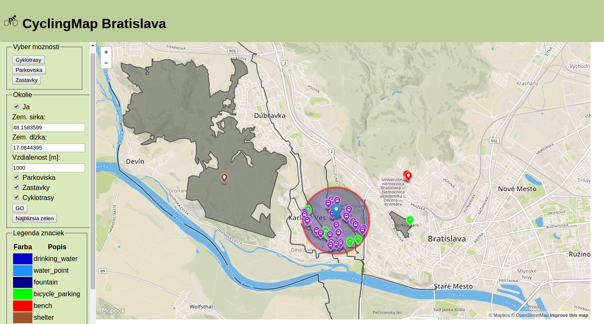
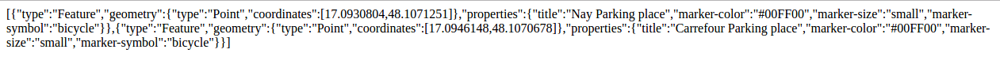
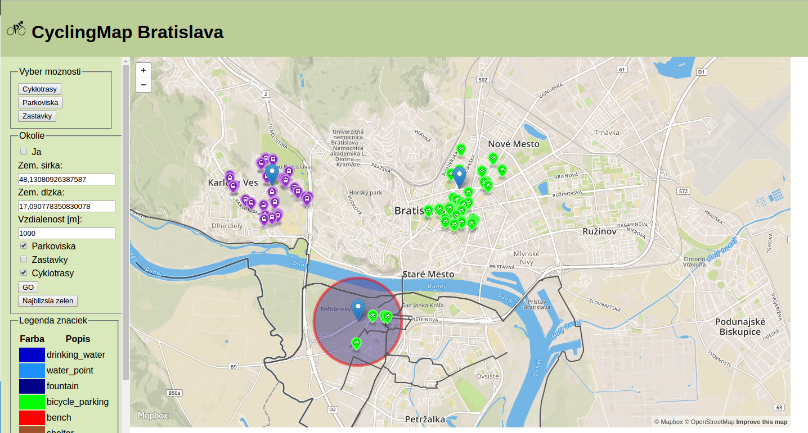
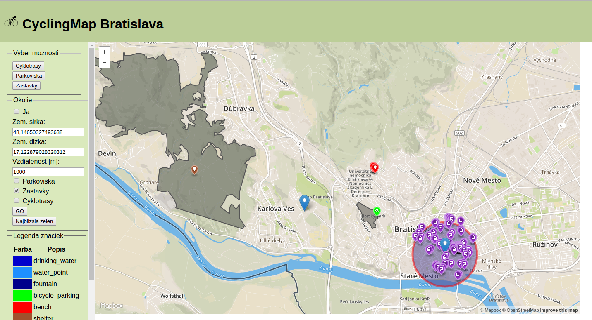

## CyclingMap Bratislava ##

**Autor:** *Tomáš Rychvalský*

**Popis:** Aplikácia umožňuje:
* Vyhľadať všetky cyklotrasy v Bratislave
* Vyhľadať všetky stojany pre bicykle v Bratislave
* Vyhľadať všetky autobusové zastávky v Bratislave
* Zistiť a zobraziť moju aktuálnu polohu (polohu je možné meniť používateľom)
* Zobraziť stojany, zastavky a cyklotrasy vo zvloneom okolí 
* Zobraziť 5 najbližších parkov od určeného miesta v ktorých sa nachádza pitná voda, stojan, lavicka, atď. 

**Dáta:** Mesto Bratislava z [Open Street Maps](https://www.openstreetmap.org/).

**Technológie** 

* *Frontend* pozostáva zo stastickej html stránky, pričom bola použitá šablóna [Boilerplate](https://html5boilerplate.com/) a upravená podľa vlastnej potreby. 
Na zobrazenie mapy je použité [Mapbox](https://www.mapbox.com/) API. 
Všetka potrebná funkcionalita je implementovaná v súbore *index.html*.
V aplikácii sú tiež použité Javascript a jQuery.

* *Beckend* pozostáva z PHP, ktoré sa stará o komunikáciu s databázou a tiež vykonáva potrebné query nad databázou.
Na komunikáciu frontedu s beckendom je použitý ajax.

* *Databáza* je použitá [PostgreSQL](https://www.postgresql.org/) s rozšírením [PostGIS](http://postgis.net/).

**API** 

V okolí 1000 metrov od určenej vyhľadá všetky dostupné stojany pre bicykle, kde *lat* a *lon* určujú polohu a *dist* okruh v
ktorom sa má vyhľadávať.

http://localhost/api/bike-parking-dist.php?lat=48.1584103&lon=17.0644564&dist=1000

Výsledkom sú dáta uložené v [GeoJSON](http://geojson.org/) formáte.

**Obrázky** 

